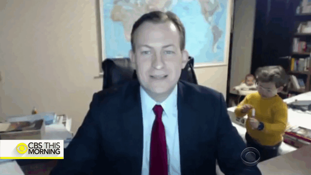
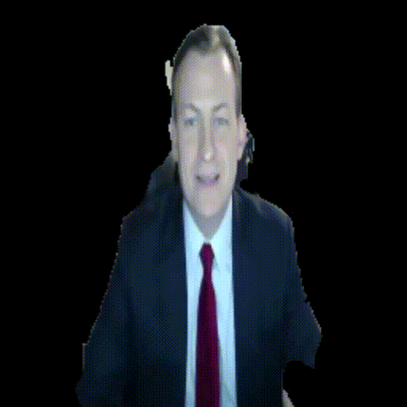

# Incognito
This project removes your background by optimizing segmentation models for CPU inference. It applies deep learning optimizations & engineering optimizations to improve CPU inference frame rate from 3 FPS to 15 FPS.

## Results

### Visual Results

<p float="left">
  
  
  
</p>


```
        Original            Unet with ResNet        Unet with MobileNet
```


<p float="left">
  
  
  
</p>


```
 UNet-EfficientNet EB0     UNet-EfficientNet EB1     UNet-EfficientNet EB2
```

### Optimization Results
|          Optimization                      | CPU Inference time    |        FPS      |       Model Size      |       IOU      |
| ------------------------------------------ |:---------------------:| ----------------|-----------------------|----------------|
| ResNet Model (256*256)                     |  ~265 ms              |        **3-4**      |         **98.2 MB**       |   0.95592      |
| Architecture Optimization (EfficientNet EB0)      |  ~229 ms              |        5-6      |         41.2 MB       |   0.96079      |
| Deep Learning Optimization (Quantization + Graph Optimization + EfficientNet EB0)              |  ~219 ms              |        5-6      |         10.6 MB       |   0.92648      |
| Engineering Optimization (Quantization + Graph Optimization + EfficientNet EB0 + Image resolution reduction - 128*128)      |  ~56 ms               |       **15-17**     |         **10.6 MB**       |   0.92648      |

### Model files
The optimized and compressed models can be found under following directory
```
/data/assets/saved_models
```


## Requirements (to-do)
Add docker image

## Presentation Slides
Further details regarding the motivation, methods and results of  different optimization
techniques can be found in my presentation 
<a href="https://docs.google.com/presentation/d/17mUs0MYfIyu67y7dTmaOWuiuaWyoe9C7ic8d2vY9b-w/edit?usp=sharing" target="_blank">here</a>.

## License

[MIT License](LICENSE)

Copyright (c) 2019 Chinmay Naik
